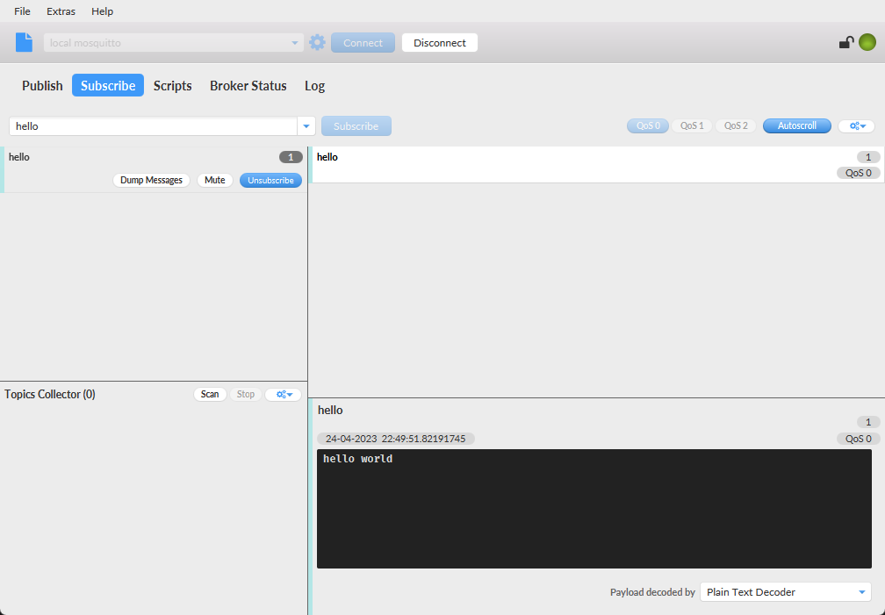

# Docker Eclipse Mosquitto

Docker Compose를 이용해서 docker broker를 실행할 수 있습니다.

클라이언트는 [MQTT.Fx 1.7.1](https://mqtt.iot01.com/apps/mqttfx/1.7.1/)을 이용해 접속합니다.

실행

``` bash
docker-compose up -d --build
```

종료

``` bash
docker-compose down -v
```

## 실행화면



